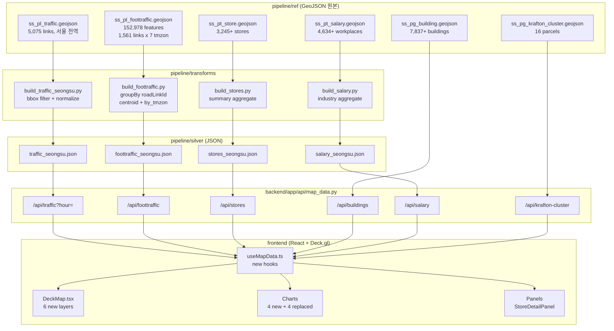
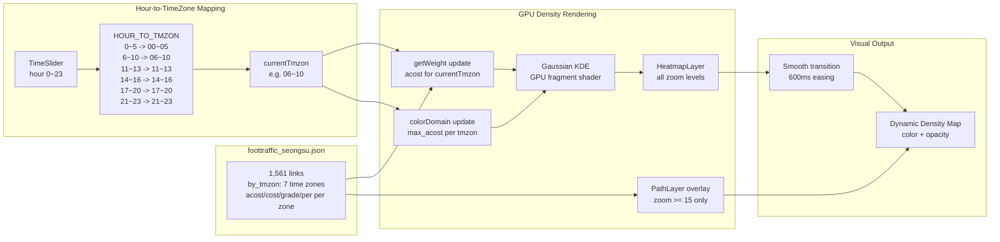

# GeoJSON 데이터 대시보드 통합 계획

## 데이터 현황 분석

6개 신규 GeoJSON + 기존 3개(subway) = 총 9개 GeoJSON. 신규 데이터의 속성 구조:

### 데이터별 핵심 속성

- **ss_pl_traffic** (5,075 LineString): 도로명, 방향, 거리, 차선수, 기능유형구분, `~01시`~~`~~24시` (시간대별 속도 km/h) -- 서울 전역이므로 성수 bbox 필터 필요
- **ss_pl_foottraffic** (152,978 features = 1,561 links x 7 tmzon x ~~14 records): `acost_int` (누적통행량), `cost` (구간통행량), `grade` (등급 1~~5), `per` (최대 대비 %), `tmzon_name` (**7개 시간대**: 00~~05, 06~~10, 11~~13, 14~~16, 17~~20, 21~~23, 종일), `dayweek_name` (주중) -- **전 시간대 커버**, 성수 지역
- **ss_pt_store** (3,245+ Point): `category_bg/mi/sl`, `gender_f/m_20~60대`, `fam_미혼/기혼/유자녀`, `peco_개인/법인/외국인`, `times_아침~새벽` (7개 시간대), `weekday_월~일`, `revfreq_평일/공휴일`
- **ss_pg_building** (7,837+ MultiPolygon): `gro_flo_co` (지상층수), `und_flo_co` (지하층수), `buld_nm`, `rd_nm`, `gu`
- **ss_pt_salary** (4,634+ Point): `사업장명`, `업종코드명`, `가입자수`, `월급여추정`, `연간급여추정`, `인당금액`, `가입상태`
- **ss_pg_krafton_cluster** (16 MultiPolygon): `jimok` (지목), `parea` (면적), `jiga_ilp` (공시지가), `owner_nm`, `jibun`

---

## Phase 1: Pipeline 전처리

### 1-1. `pipeline/transforms/build_traffic_seongsu.py`

서울 전역 traffic에서 성수 bbox (약 `[127.035, 37.535, 127.070, 37.555]`)로 필터링 + 시간대별 속도를 배열로 정규화.

```python
# 출력: pipeline/silver/traffic_seongsu.json
{
  "segments": [
    {
      "link_id": "...", "road_name": "...", "direction": "...",
      "distance": 953, "lanes": 3, "road_type": "주간선도로",
      "speeds": [31.18, 32.01, ...],  // 24개 (01시~24시)
      "coordinates": [[lng, lat], ...]
    }
  ]
}
```

### 1-2. `pipeline/transforms/build_foottraffic.py`

152,978개 features를 `roadLinkId` 기준으로 집계. 각 링크에 대해 7개 시간대(tmzon)의 통행량을 배열로 정규화. centroid 추출하여 HeatmapLayer용 포인트도 생성.

```python
# 원본 구조: 1,561 links x 7 tmzon (00~05, 06~10, 11~13, 14~16, 17~20, 21~23, 종일)
# 시간대 매핑: hour 0~5 → "00~05", 6~10 → "06~10", 11~13 → "11~13",
#             14~16 → "14~16", 17~20 → "17~20", 21~23 → "21~23"

# 출력: pipeline/silver/foottraffic_seongsu.json
{
  "links": [
    {
      "road_link_id": "106743",
      "coordinates": [[lng, lat], ...],
      "centroid": [127.065, 37.545],
      "by_tmzon": {
        "00~05": {"acost": 120, "cost": 95, "grade": 2, "per": 16.6},
        "06~10": {"acost": 380, "cost": 310, "grade": 4, "per": 52.7},
        "11~13": {"acost": 520, "cost": 450, "grade": 5, "per": 72.1},
        "14~16": {"acost": 480, "cost": 400, "grade": 4, "per": 66.6},
        "17~20": {"acost": 610, "cost": 540, "grade": 5, "per": 84.6},
        "21~23": {"acost": 721, "cost": 721, "grade": 5, "per": 100.0},
        "종일":  {"acost": 2831, "cost": 2516, "grade": 5, "per": 49.0}
      }
    }
  ],
  "meta": {
    "tmzon_list": ["00~05","06~10","11~13","14~16","17~20","21~23","종일"],
    "hour_to_tmzon": {"0":"00~05","1":"00~05",...,"23":"21~23"},
    "max_acost_by_tmzon": {"00~05": 180, "06~10": 520, ...}
  }
}
```

### 1-3. `pipeline/transforms/build_stores.py`

상가 데이터의 카테고리 + 시간대 패턴을 집계하여 차트용 summary 생성.

```python
# 출력: pipeline/silver/stores_seongsu.json
{
  "stores": [...],  // 원본 유지 (GeoJSON → flat JSON)
  "summary": {
    "by_category": {"음식": 1820, "소매": 780, ...},
    "time_profile": {"아침": 총합, "점심": 총합, ...},
    "top_stores": [...]
  }
}
```

### 1-4. `pipeline/transforms/build_salary.py`

급여 데이터 요약 + 업종별 집계.

```python
# 출력: pipeline/silver/salary_seongsu.json
{
  "workplaces": [...],
  "summary": {
    "by_industry": [{"industry": "...", "count": N, "avg_salary": ...}],
    "total_employees": ..., "avg_salary": ...
  }
}
```

건물 / 크래프톤 클러스터는 원본 GeoJSON을 직접 서빙 (파일 크기 관리 가능).

---

## Phase 2: Backend API 엔드포인트

`[backend/app/api/map_data.py](backend/app/api/map_data.py)`에 추가:


| Endpoint               | 데이터 소스                              | 쿼리 파라미터                   | 반환                                   |
| ---------------------- | ----------------------------------- | ------------------------- | ------------------------------------ |
| `/api/traffic`         | `silver/traffic_seongsu.json`       | `hour` (0~23)             | 세그먼트 + 해당 시간 속도                      |
| `/api/foottraffic`     | `silver/foottraffic_seongsu.json`   | --                        | 링크별 통행량 (centroid + by_tmzon 7개 시간대) |
| `/api/stores`          | `silver/stores_seongsu.json`        | `category?`, `time_slot?` | 필터된 상가 목록                            |
| `/api/stores/summary`  | `silver/stores_seongsu.json`        | --                        | 집계 통계                                |
| `/api/buildings`       | `ref/ss_pg_building.geojson`        | --                        | GeoJSON passthrough                  |
| `/api/salary`          | `silver/salary_seongsu.json`        | `industry?`               | 사업장 + 요약                             |
| `/api/krafton-cluster` | `ref/ss_pg_krafton_cluster.geojson` | --                        | GeoJSON passthrough                  |


각 엔드포인트는 `@lru_cache`로 파일 로딩 캐싱 (기존 `bus_json.py` 패턴 활용).

---

## Phase 3: Frontend 지도 레이어

`[frontend/src/components/DeckMap.tsx](frontend/src/components/DeckMap.tsx)`에 추가할 레이어:

### 3-1. 도로 교통속도 레이어 (기존 `road-segments` 대체)

- **Layer**: `PathLayer` -- 시간대별 속도를 색상으로 인코딩
- **Color**: 속도 기반 (고속=초록, 저속=빨강) -- 기존 V/C 컬러와 유사하게 반전
- **Width**: 차선수(`lanes`) 비례
- **TimeSlider 연동**: `hour` 변경 시 해당 시간대 속도로 색상 업데이트
- **Tooltip**: 도로명, 방향, 현재속도, 차선수, 도로유형

### 3-2. 보행자 통행량 레이어 -- Kepler.gl 스타일 동적 밀도

#### 데이터 구조

원본 데이터가 **7개 시간대**(00~~05, 06~~10, 11~~13, 14~~16, 17~~20, 21~~23, 종일) 전체를 포함하므로, TimeSlider의 `hour` 값으로 직접 해당 시간대의 실측 통행량을 매핑:

```typescript
const HOUR_TO_TMZON: Record<number, string> = {
  0: '00~05', 1: '00~05', 2: '00~05', 3: '00~05', 4: '00~05', 5: '00~05',
  6: '06~10', 7: '06~10', 8: '06~10', 9: '06~10', 10: '06~10',
  11: '11~13', 12: '11~13', 13: '11~13',
  14: '14~16', 15: '14~16', 16: '14~16',
  17: '17~20', 18: '17~20', 19: '17~20', 20: '17~20',
  21: '21~23', 22: '21~23', 23: '21~23',
};
```

#### GPU 기반 동적 밀도 렌더링 (Kepler.gl 참조)

Kepler.gl의 Heatmap 레이어는 내부적으로 Deck.gl의 HeatmapLayer를 사용하며, 핵심 동작 원리:

1. **Gaussian KDE on GPU**: 각 포인트 주위에 가우시안 커널을 배치, 프래그먼트 셰이더에서 밀도를 합산
2. **Zoom-adaptive radius**: `radiusPixels`는 화면 픽셀 기준이므로 줌 변경 시 자동으로 공간 해상도 조정
3. **Dynamic weight update**: `getWeight` accessor가 변경되면 GPU 버퍼를 갱신하여 실시간 밀도 재계산
4. **Color domain auto-scaling**: `colorDomain`을 시간대별 `max_acost`로 동적 설정

구현 방식:

```typescript
const currentTmzon = HOUR_TO_TMZON[hour];
const maxAcost = meta.max_acost_by_tmzon[currentTmzon];

new HeatmapLayer({
  id: 'foottraffic-density',
  data: foottrafficLinks,
  getPosition: d => d.centroid,
  getWeight: d => d.by_tmzon[currentTmzon]?.acost ?? 0,
  radiusPixels: 50,
  intensity: 2.0,
  threshold: 0.03,
  colorDomain: [0, maxAcost],
  colorRange: [
    [0, 25, 0, 25],       // 매우 낮음 (거의 투명 다크 그린)
    [0, 104, 55, 100],    // 낮음
    [49, 163, 84, 160],   // 보통
    [255, 255, 0, 200],   // 높음 (노랑)
    [255, 127, 0, 230],   // 매우 높음 (오렌지)
    [255, 0, 0, 255]      // 최고 (빨강)
  ],
  // Kepler 스타일: 시간대 전환 시 부드러운 트랜지션
  updateTriggers: {
    getWeight: [currentTmzon]
  },
  transitions: {
    getWeight: { duration: 600, easing: t => t * (2 - t) }
  }
})
```

#### 핵심 동작 흐름

1. **TimeSlider hour 변경** → `currentTmzon` 결정 (예: hour=8 → "06~10")
2. `**getWeight` accessor 갱신** → 각 링크의 해당 시간대 `acost` 값으로 가중치 변경
3. `**colorDomain` 갱신** → 시간대별 최대값으로 색상 스케일 재조정
4. **GPU가 KDE 재계산** → 화면에 밀도 분포가 부드럽게 전환
5. **Zoom 변경 시** → `radiusPixels`가 화면 기준이므로 자동으로 해상도 변경 (확대하면 세밀, 축소하면 넓게)

#### 줌 기반 상세 전환 (보조 레이어)

줌 15 이상에서는 HeatmapLayer 위에 PathLayer를 오버레이하여 개별 도로 수준의 통행량을 확인:

```typescript
new PathLayer({
  id: 'foottraffic-paths',
  data: foottrafficLinks,
  visible: zoom >= 15,
  getPath: d => d.coordinates,
  getColor: d => gradeColor(d.by_tmzon[currentTmzon]?.grade ?? 1),
  getWidth: d => Math.max(2, (d.by_tmzon[currentTmzon]?.per ?? 0) / 8),
  widthMinPixels: 1,
  widthMaxPixels: 12,
  opacity: 0.8,
  updateTriggers: {
    getColor: [currentTmzon],
    getWidth: [currentTmzon]
  },
  transitions: {
    getColor: { duration: 400 },
    getWidth: { duration: 400 }
  }
})
```

#### Kepler 대비 차이점 및 추가 고려

- Kepler는 `aggregation: 'SUM'`을 GPU compute shader로 처리. Deck.gl HeatmapLayer도 동일 방식 지원
- `종일` 데이터는 차트(FoottrafficDensityChart)에서 전체 일일 총량 비교용으로 활용
- `mxcost` 필드가 시간대별로 다르므로 (`tmzon=06`은 721, `tmzon=00`은 5778), `colorDomain`을 시간대별로 동적 설정하는 것이 핵심

### 3-3. 상가 레이어

- **Layer**: `ScatterplotLayer`
- **Color**: `category_bg` 기준 (음식=주황, 소매=파랑, 서비스=보라, 기타=회색)
- **Radius**: `총 방문자수(peco_개인 + peco_법인 + peco_외국인)` 기반 sqrt 스케일
- **TimeSlider 연동**: 현재 시간대의 방문자 비율로 opacity 조절 (점심시간에 음식점이 밝게)
- **Tooltip**: 상호명, 카테고리, 주소, 현재 시간대 방문자수
- **Click**: 상세 패널 (아래 Phase 4)

### 3-4. 건물 3D 레이어

```typescript
new GeoJsonLayer({
  id: 'buildings-3d',
  data: buildingsGeoJson,
  extruded: true,
  wireframe: true,
  getElevation: d => (d.properties.gro_flo_co || 1) * 3.5,  // 층당 3.5m
  getFillColor: d => buildingColor(d.properties.gro_flo_co),
  opacity: 0.6,
  material: { ambient: 0.3, diffuse: 0.6, shininess: 32 }
})
```

- 층수별 색상 그라데이션: 1~~3층(밝은 회색) → 4~~10층(파란 계열) → 10층+(보라)
- `wireframe: true`로 건물 윤곽선 표시

### 3-5. 급여/사업장 레이어

- **Layer**: `ScatterplotLayer`
- **Color**: `업종코드명` 기반 카테고리 색상 (제조업=파랑, IT=보라, 서비스=초록, 운수=주황 등)
- **Radius**: `가입자수` 기반 sqrt 스케일
- **Tooltip**: 사업장명, 업종, 가입자수, 월급여추정, 인당금액

### 3-6. 크래프톤 클러스터 레이어

- **Layer**: `GeoJsonLayer` (폴리곤 경계)
- **FillColor**: 반투명 강조색 (지가 기준 그라데이션)
- **StrokeColor**: 밝은 강조선
- **Tooltip**: 지번, 지목, 면적, 공시지가, 소유구분
- 항상 표시 또는 별도 토글

---

## Phase 4: Frontend 차트 및 패널

### 4-1. Sidebar 레이어 토글 추가

`[frontend/src/components/Sidebar.tsx](frontend/src/components/Sidebar.tsx)`에 기존 7개 토글 외 추가:

- `store` (상가) -- infrastructure 뷰
- `building` (건물 3D) -- infrastructure 뷰
- `salary` (사업장) -- infrastructure 뷰
- `foottraffic` (보행 밀도) -- flow 뷰
- `krafton` (클러스터) -- 전체 뷰

### 4-2. 신규 차트 컴포넌트

#### `TrafficSpeedChart.tsx` -- infrastructure 뷰

- 선택된 도로 구간(또는 전체 평균)의 24시간 속도 추이 Area chart
- 현재 시간 마커 (수직선)
- 피크/비피크 영역 하이라이트
- **데이터**: `traffic.segments[].speeds[]`

#### `StoreAnalysisChart.tsx` -- infrastructure 뷰

- 업종별 분포 Donut chart + 시간대별 방문 패턴 Grouped bar
- 성별/연령대 방문자 비율 Stacked bar
- 평일/공휴일 비교 바
- **데이터**: `stores.summary` + `stores.stores[]`

#### `FoottrafficDensityChart.tsx` -- flow 뷰 (기존 PedestrianChart 대체)

- **시간대별 총 통행량 추이** area chart (7개 tmzon, 현재 시간 마커)
- 등급별(grade 1~5) 구간 수 분포 bar chart (현재 시간대 기준)
- 통행량 상위 10개 구간 horizontal bar (현재 시간대 기준)
- **데이터**: `foottraffic.links[].by_tmzon`, `currentHour` prop

#### `SalaryDistributionChart.tsx` -- infrastructure 뷰

- 업종별 평균 급여 horizontal bar (상위 15)
- 가입자수 vs 인당금액 scatter plot
- **데이터**: `salary.summary.by_industry`

#### `StoreDetailPanel.tsx` -- 상가 클릭 시 슬라이드 패널

- 상호명, 카테고리, 주소
- 7개 시간대 방문 패턴 radial bar
- 요일별 방문 bar chart
- 성별/연령 비율 horizontal stacked bar
- 개인/법인/외국인 비율 donut

### 4-3. 기존 차트 실데이터 교체


| 기존 차트                  | 현재 상태            | 교체 데이터                                    |
| ---------------------- | ---------------- | ----------------------------------------- |
| `PedestrianChart`      | 정적 SAMPLE_DATA   | foottraffic 등급별 분포                        |
| `PedDensityTrendChart` | 생성된 mock         | foottraffic 시간대별 총 통행량 추이 (실측 7개 tmzon)   |
| `CongestionChart`      | 정적 ROAD_SEGMENTS | traffic_seongsu 속도 데이터                    |
| `AccessibilityChart`   | 정적 DATA          | 교통수단별 접근성 (subway + bus + foottraffic 조합) |


---

## Phase 5: 크로스 데이터 분석

### 5-1. 보행-상권 상관 분석

- foottraffic 밀도가 높은 구간 주변 반경 50m 내 상가 수/평균 매출 집계
- Scatter plot: X축=보행 밀도, Y축=상가 매출 → 상관계수 표시

### 5-2. 직주 근접성 분석

- salary 데이터의 사업장 위치 + subway/bus 접근성 → 통근 편의성 점수
- 건물 3D 레이어에 salary 밀도 오버레이

### 5-3. 시간대별 클러스터 활력도

- Krafton 클러스터 내 상가의 시간대별 방문 패턴 집계
- 클러스터 내 vs 외 비교 bar chart

---

## 데이터 흐름 다이어그램




---

## 보행자 통행량 동적 시각화 상세




---

## 파일 변경 목록

### 신규 생성 (11개)

- `pipeline/transforms/build_traffic_seongsu.py`
- `pipeline/transforms/build_foottraffic.py`
- `pipeline/transforms/build_stores.py`
- `pipeline/transforms/build_salary.py`
- `frontend/src/components/TrafficSpeedChart.tsx`
- `frontend/src/components/StoreAnalysisChart.tsx`
- `frontend/src/components/FoottrafficDensityChart.tsx`
- `frontend/src/components/SalaryDistributionChart.tsx`
- `frontend/src/components/StoreDetailPanel.tsx`
- `frontend/src/components/StoreDetailPanel.css`
- `frontend/src/lib/layer_colors.ts` (신규 레이어 색상 함수)

### 수정 (8개)

- `[backend/app/api/map_data.py](backend/app/api/map_data.py)` -- 6개 엔드포인트 추가
- `[frontend/src/hooks/useMapData.ts](frontend/src/hooks/useMapData.ts)` -- 6개 새 훅
- `[frontend/src/api/client.ts](frontend/src/api/client.ts)` -- 6개 새 fetch 함수
- `[frontend/src/components/DeckMap.tsx](frontend/src/components/DeckMap.tsx)` -- 6개 새 레이어
- `[frontend/src/components/Sidebar.tsx](frontend/src/components/Sidebar.tsx)` -- 5개 토글 추가
- `[frontend/src/components/RightPanel.tsx](frontend/src/components/RightPanel.tsx)` -- 차트 교체/추가
- `[frontend/src/views/Dashboard.tsx](frontend/src/views/Dashboard.tsx)` -- 새 hooks 연결 + StoreDetailPanel
- `[frontend/src/components/MapOverlays.tsx](frontend/src/components/MapOverlays.tsx)` -- 범례 추가

